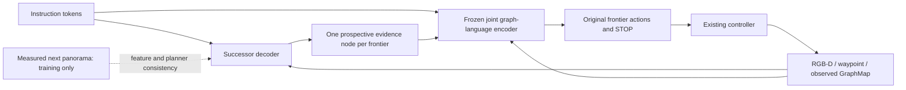

# GaussReg-VLN v11 — E12 Successor Evidence Graph

Date: 2026-09-06. Stage: design frozen; local implementation verified; production G1/G2 pending.
Owner sequence: CCFA pipeline orchestrator → idea optimizer → idea reviewer →
experiment designer → implementation. This is an experiment plan, not a manuscript
or a claim of a positive result. The single performance ledger is `experiment.md`.

## Understanding, assumptions, and protocol

Strict E0 remains the reference: R2R-CE val_unseen, 1,839 episodes, NE 3.940670,
OSR 71.3975, SR 65.3072, SPL 55.7488, nDTW 65.8165, SDTW 53.9994.
E11 completed successfully but lost SR/SPL. Its complete result closes geometry-only
repair; it does not diagnose a checkpoint failure. Average R2R graph size is 17.36,
so memory compression is not the target. E9/E10 do not prove that all policy
learning is harmful, but reject their full-policy/coarse-outcome or short-progress
recipes. The leading working hypothesis is insufficient language-conditioned
frontier discrimination and prospective coverage; aggregate metrics alone do not
establish a unique causal bottleneck.

Code observations: CLIP RGB and DDPPO depth feed the panorama encoder. The waypoint
predictor currently consumes depth features only. GraphMap stores visited panorama
means and averages source-view candidate embeddings for merged ghosts. Production
navigation uses the global branch; the presence of LocalVPEncoder in the file does
not mean a local branch participates in this forward path. Candidate geometry is
available only in E11 and will be disabled in E12.
Ghosts average only 1.41 source observations; 71.1% have exactly one. A ghost is
not a twelve-view panorama. This limits candidate B's aggregation opportunity.

Assumptions: the server still has the strict release checkpoint, joint pretrained
checkpoint, MP3D and the existing training split. No new sensor, goal-location
input, target prior, external teacher, image synthesis model, or external data is
introduced. No <100M constraint is imposed. E0 weights stay frozen. New simulator
rollouts and decoder parameters must be counted. Use the same `_10` training
subset as recent experiments; record its actual episode count/hash rather than
guessing what the suffix means. Training now explicitly uses `control`, matching
evaluation; older scripts inherited `teleport` for training. Report this training
change, and isolate it in a later controlled ablation if E12 passes.

R2R evaluation: panoramic RGB-D, HFOV 90, ALLOW_SLIDING=True, control backtracking,
max 15 high-level decisions, 3 m success boundary, greedy policy, unchanged E0
evaluator. All 1,839 episode IDs must match the dataset, not merely its count.
Percent metrics are reported on 0–100; JSON stores fractions. RxR is a subsequent
separate experiment with its own checkpoint, sensor FOV, sliding setting and
language coverage; English-only reports are not multilingual comparisons.

## Three candidates and selection

| Candidate | Mechanism / causal hypothesis | Code surface | Risk / fastest falsifier |
| --- | --- | --- | --- |
| A: Successor Evidence Graph (SEG) | Predict the observation after reaching each frontier; attach it as non-actionable evidence to that frontier; jointly reason over observed and prospective evidence. Better branch semantics may expand OSR; fewer wrong turns may improve SR/SPL. | One latent decoder, graph expansion in model forward, arrival pairing and supervised update in trainer, strict evaluation load contract. GraphMap and waypoint/controller unchanged. | Hallucination or feature copying; test prediction versus copying on realized arrivals and whether true-arrival evidence changes decisions usefully. Fixed full evaluation is decisive. |
| B: Instruction–Frontier Transport | Keep the multiple source observations of each ghost; transport instruction-token mass to those views before aggregation. Reduce destructive averaging of ambiguous landmarks. | GraphMap observation sets, masks and token-level aggregation, representation training. | Most ghosts have only one observation, and no view beyond the doorway; an equal-parameter mean-pooling replacement must lose for this mechanism to be supported. |
| C: Ordered Subgoal Planner | Maintain an ordered latent instruction state; select frontiers for the next subgoal and update that state from actual observations. Reduce instruction skipping and redundant exploration. | Persistent language state in train/eval, subgoal alignment objective and planner interface. | Incorrect phase transitions compound; a long-instruction training diagnostic and a state-free matched model can falsify the benefit. |

Closest-work subtraction applies to all three: E0 scores source-view graph
features; LCGNav adds local candidate geometry; TAMP-Nav uses VLM pixel actions,
selective reasoning/memory and two-level GRPO; OmniNav combines navigation tasks,
large multitask data and fast/slow planning. A adds prospective semantic evidence,
B changes observation binding, C changes the planning state. None reproduces the
competitors' data/model/action protocols.

Decision axes (ordinal 1–5, not predicted point gains):

| Candidate | Expected joint metric potential | Innovation clarity | Feasibility | Open-source simplicity | Rank |
| --- | ---: | ---: | ---: | ---: | ---: |
| A | 4 | 4 | 4 | 4 | 1 |
| B | 3 | 3 | 4 | 4 | 2 |
| C | 4 | 3 | 2 | 2 | 3 |

B's metric/clarity deductions reflect its lack of future evidence and proximity to
attention pooling; future-view discrimination beating a matched aggregator would
raise both toward 4. C's deductions reflect Progress-Think overlap, missing phase
supervision and additional persistent state; stable alignment with one shared
planner and a matched state-free win would raise these toward 4.

Only A is implemented. B and C are alternatives, not modules in A.

## Prior art and review

Public-safe search performed on 2026-09-06; coverage is targeted, not exhaustive.

| Source | Supported fact | Design consequence |
| --- | --- | --- |
| [HNR-VLN, CVPR 2024](https://arxiv.org/abs/2404.01943) | Predicts semantic future views with a hierarchical neural radiance representation and evaluates a future path tree. | Future prediction alone is not novel. SEG tests direct arrival-latent learning and owner-linked evidence in the existing small graph, without a feature cloud or volume rendering. |
| [Future-view semantics, CVPR 2023](https://arxiv.org/abs/2304.04907) | Uses future-view semantic generation in navigation pretraining. | Do not claim the first latent future-view predictor. |
| [Progress-Think, CVPR 2026](https://openaccess.thecvf.com/content/CVPR2026/html/Wang_Progress-Think_Semantic_Progress_Reasoning_for_Vision-Language_Navigation_CVPR_2026_paper.html) | Uses monotonic semantic progress and staged alignment/policy training. | Candidate C needs a stronger difference than ordered instruction progress. |
| [Phi-Nav, ECCV 2026](https://arxiv.org/abs/2607.01754) | Relabels exploratory trajectories with a hindsight speaker and another imitation pass. | SEG uses measured arrival embeddings, not generated instructions. |
| [LCGNav](https://arxiv.org/abs/2605.09053), [TAMP-Nav](https://arxiv.org/abs/2608.17512), [OmniNav](https://arxiv.org/abs/2509.25687) | Local geometry, two-level VLM alignment, and unified prospective navigation are existing directions. | Geometry, global/local reward mixing and fast/slow composition are excluded from this first version. |

These facts ground the alternatives, not a claim that SEG will beat the sources.
No newly consulted third-party implementation is copied. Existing ETP-R1 production
code is modified within this project; the absence of an upstream top-level license
must not be misrepresented as a new redistribution license.

CCFA review dimensions and fixed weights, A/B/C scores:

| Dimension | Weight | A | B | C |
| --- | ---: | ---: | ---: | ---: |
| Problem importance | 12 | 5 | 5 | 5 |
| Novelty | 14 | 3 | 3 | 2 |
| Conceptual innovation | 12 | 4 | 3 | 4 |
| Soundness | 14 | 3 | 4 | 3 |
| Elegance | 8 | 4 | 4 | 3 |
| Feasibility | 8 | 4 | 4 | 2 |
| Evidence design | 10 | 4 | 4 | 3 |
| Venue fit | 8 | 4 | 4 | 4 |
| Timeliness | 6 | 4 | 3 | 3 |
| Readiness after risks | 8 | 3 | 3 | 2 |

Weighted A=3.76, B=3.72, C=3.14. These are development assessments, not acceptance
probabilities. Confidence: medium on code/protocol, low on gains and novelty.
A: revise-and-test; B: reserve; C: pivot toward a simpler state formulation if ever
reopened. All readiness scores ≤3 reflect absent positive full results. A's novelty
deduction is HNR overlap; a matched direct-latent versus generic future-evidence
comparison plus useful branch-reveal supervision could raise it toward 4. A's
soundness deduction is that a frozen E0 may not use predicted evidence beneficially;
real-arrival intervention and full results must resolve that, not prose. B's novelty,
concept and timeliness deductions are attention-pooling overlap, requiring a
specific cancellation failure and controlled repair. C's novelty, soundness,
evidence and timeliness deductions require a distinction from Progress-Think and
reliable phase labels; its feasibility/elegance deductions require fewer state
interfaces. These conditions can raise individual scores, not guarantee acceptance.

Separate review lenses before synthesis: field lens challenges whether ghost-view
semantics cause actual coverage errors; method lens challenges multimodal future
uncertainty; experiment lens requires fixed 1,839-episode joint gains and an actual
arrival control; venue lens finds no current Oral-quality evidence; prior-art lens
identifies HNR as the strongest overlap. Synthesis: build one falsifiable model,
withhold novelty/performance claims, stop the fixed recipe if its full gate fails.

## Method and fixed implementation contract

Given instruction tokens L and current graph features X, one 256-wide, four-head
cross-attention decoder predicts the panorama embedding after executing each
frontier action. Its query is the frontier feature plus its existing position
embedding; keys/values are the instruction and observed graph. A single output
projection produces a 768-D successor feature (1,119,744 added parameters). No scalar residual or STOP head.

For every valid unvisited frontier f, append virtual evidence node u_f at its
estimated location. It inherits f's known graph distances and positional/task
embedding. It is never an action, a visited node or persistent map entry. Run the
existing frozen crossmodal graph encoder on [X; predicted successors]; use its
original action readout on the original graph slots only. Recompute after every
real observation. Geometry is a location prior already available to E0, not goal
information or a predicted hidden map. The future is one executed topological
action (which can include backtracking), not three imaginary environment steps.

Training uses the frozen E0 categorical behavior policy, eight trajectories per
iteration, on the existing train subset. Reuse the same model with SEG bypassed
for sampling; do not allocate an additional full policy. Pair an executed movement
at t with the next real panorama at t+1 using original environment identities.
STOP, forced horizon termination, paused environments and failed arrivals are
not future observations. Arrival tolerance is the existing 0.5 m localization
radius. Do not label unexecuted alternatives as negative outcomes.

The loss is SmoothL1(predicted arrival, detached measured arrival) plus categorical
KL from a frozen planner forward that substitutes the measured arrival at that
single frontier. Other predicted successors are identical detached values in the
target forward. Both terms have coefficient 1. This trains the *same evidence*
for feature fidelity and its effect on the action distribution. No goal reward,
geodesic progress or trajectory advantage enters this update. The target uses the
existing frozen E0 encoder/readout, no external teacher or generated labels.
Unknown branch outcomes are not treated as counterfactual ground truth.

Freeze E0, use AdamW 1e-4→2.5e-5 cosine, clip norm 2, one update per nonempty iteration,
no AMP/dropout/waypoint augmentation. Explicit control backtracking gives measured
arrivals under the evaluation controller. A fixed E0 behavior distribution may
limit coverage of new-policy states; report this risk without silently adding
DAgger or a second training stage. Fresh SEG initialization changes the enabled
forward; do not claim zero-init E0 identity. Disabled mode must preserve E0.
Iterations with no valid arrival pair skip the optimizer and log zero pairs;
the checkpoint stores the successful update count and initial decoder fingerprint.
Both training stages must produce changed finite decoder tensors and preserve
every E0 tensor bitwise. A nonzero update counter alone is insufficient.

## Figure, benchmarks, main table, ablation, qualitative, generalization



Problem → ambiguous frontier semantics; prior limitation → only source views and
local free space; method → branch-linked successor evidence; figure → above;
benchmark → strict R2R first, RxR next; main table → E0 local, E12 local, LCGNav
reported with training differences identified. TAMP/Omni results occupy separate
model/data/action-protocol rows, not a same-condition ranking.

| Local R2R row | NE↓ | OSR↑ | SR↑ | SPL↑ | nDTW↑ | SDTW↑ |
| --- | ---: | ---: | ---: | ---: | ---: | ---: |
| Strict E0 | 3.940670 | 71.3975 | 65.3072 | 55.7488 | 65.8165 | 53.9994 |
| E12 fixed iteration 500 | TBD | TBD | TBD | TBD | TBD | TBD |

After a passing full result, minimal ablations are: (1) copy frontier features into
virtual nodes with the same graph expansion, (2) remove planner-consistency KL,
(3) remove language from successor prediction with matched dimensions. The first
separates semantic prediction from token duplication; the second tests decision
alignment; the third tests instruction conditioning. A training-controller control
separates the declared control/teleport change. No hyperparameter sweep.

Qualitative: fixed episode-ID selection among E0 failures recovered, E0 successes
lost and unchanged cases; show original candidate views, predicted-versus-arrived
embedding similarity, candidate probabilities and executed paths. Graph sizes,
latency, memory, decoder parameter count and simulator-hours accompany results.
Generalization: after passing R2R, repeat the frozen recipe with RxR's own E0 and
full 11,006-episode multilingual protocol; separately report zero-shot transfer if
tested. No R2R-val_unseen checkpoint or coefficient selection.

## Gates and execution

G0 tests: pairing/arrival correctness, masks, graph ownership/distances, gradients,
old-mode regression, strict load and nonfinite rejection. G1 production model
smoke plus 20 fresh training iterations: finite loss/gradient, actual arrival pairs,
changed decoder weights and unchanged E0. These are engineering gates only.
G2 independently initialize from strict E0, train 500 iterations, evaluate exactly
iteration 500 once on all 1,839 episodes. Never continue the 20-round checkpoint.

GO requires all six simultaneously: NE<3.93, OSR>71.45, SR>65.31, SPL>56.85,
nDTW>65.8165, SDTW>53.9994. Passing opens confirmation, ablations and RxR; it does
not establish statistical significance or an Oral-level paper. Report paired
episode changes and uncertainty at confirmation. Failure closes this fixed recipe;
do not scan checkpoints, scales, decoder widths or val_unseen thresholds.

Stretch targets: R2R NE<3.85, OSR>74.5, SR>66.2, SPL>58.8; RxR NE<4.32, SR>65.7,
SPL>56.9, nDTW>72.4. These are numerical targets from a different model/action
protocol, not evidence of fair head-to-head superiority.

No existing ccfa.yaml was found. Project state: stage=production-validation;
selected=E12-SEG; completed_gate=local G0; next=production G1/G2; ledger=experiment.md.
Do not introduce a second experiment ledger in the production checkout. The
results checker writes machine-readable evidence for later import into that ledger.

## Reproduction and handoff

The canonical research plan is workspace `new_papers/GaussReg_VLN_Research_Plan_v11.md`.
Its identical versioned snapshot travels with the production code as
`docs/e12_successor_evidence.md`; neither file replaces the root experiment ledger.
Local validation: 66 tests passed; compileall, shell syntax and diff checks passed.
Local tests exercise real graph/navigation attention with a small configuration,
arrival replay, checkpoint gates and shell orchestration. The unavailable
HuggingFace constructor is shimmed only in local integration tests; Habitat,
production checkpoint loading, GPU memory and simulator runtime remain server gates.

```bash
python3 -m pytest -q --rootdir=tests --confcutdir=tests tests
python3 -m compileall -q vlnce_baselines tools
bash -n run_r2r/e12_closed_loop_1gpu.bash
git diff --check
```

Server synchronization and single entry point (GPU 1 training, GPU 2 evaluation,
sequential; 20/500 are trainer iterations, not dataset epochs):

```bash
cd ~/dy/VLN/GaussReg-VLN
git fetch https://github.com/ChizkiyahuOhayon/GaussReg-VLN.git exp/e4-gaussian-bev
git merge --ff-only FETCH_HEAD
source "$(conda info --base)/etc/profile.d/conda.sh"
conda activate havlnce
bash run_r2r/e12_closed_loop_1gpu.bash 1 2 1 4 2434
```

Evidence is under `data/logs/e12_r2r_successor/`: manifest and asset hashes,
model smoke, train20/check20, train500/check500, full evaluation, six-metric
`full_result.json`, and phase/exit status. A performance no-go still means the
execution completed successfully. Existing evidence directories cause a stop;
an infrastructure retry uses a fresh `E12_RUN_ID` and starts again from E0.
