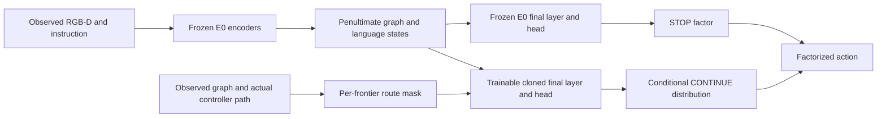

# E18: Executable Route Attention — fixed structural-reset experiment

Status: selected and entering implementation, 2026-09-12. No E18 performance result exists.
Contract: handover/ASTRA_PROMPT.md. Production starting revision d42ed43c7fafeae0d8ef2e73c95cb80683e331dc.

## Evidence and problem
Strict E0 and E15 use all 1,839 R2R-CE val_unseen episodes. E15 is the current best development anchor, with NE 3.931522907625404, OSR 71.72376291462751, SR 65.47036432843937, SPL 55.84626062781841, nDTW 66.02703298613687, SDTW 54.024968699571744. Relative to strict E0 it has only +3 net successes and +6 net oracle successes. E17 retry1 is a valid six-metric regression after its finite-gradient fix and is closed. E16 regresses on five metrics. Neither checkpoint may initialize E18.

E14 increases coverage but reduces successful completion; this motivates preserving the STOP interface while learning a substantially richer candidate representation. It does not establish a causal diagnosis. E2 was only a 100-episode scale probe, not a full benchmark. The early E0 table in §3.8 differs from the subsequent strict E0 and must not be mixed into paired comparisons. Diagnostic node success (67.6%) is not official episode SR. Ghosts average only 1.41 source observations, with 71.1% single-source: multi-view pooling alone has limited headroom.

Current hypothesis: candidate representations do not sufficiently distinguish the known route the controller must traverse before reaching a selected frontier. Full-graph attention can make unrelated nodes compete with route evidence. This is a hypothesis; the matched control below can falsify it.

## Three candidates and fixed ranking
Scores 1–5; weights success-set potential .30, SPL .25, novelty clarity .15, feasibility .15, comparability .15. Scores are qualitative judgments, not predicted benchmark points.

| Candidate | Success | SPL | Novelty | Feasible | Comparable | Weighted |
|---|---:|---:|---:|---:|---:|---:|
| A: executable route attention |4|4|3|4|5|4.00|
| B: branch-suffix success value planning |4|4|4|2|4|3.70|
| C: region-language pretraining upgrade |5|4|2|2|2|3.35|

A inputs the instruction, observed graph features and actual controller paths; outputs a conditional distribution over frontiers. Better branch selection could improve coverage/success while avoiding wasted traversals. Minimum surface: graph-input masks, a copied final crossmodal layer/readout, GRPO freezing/loading, evaluator and protocol. Strongest failure: relevant off-route context is lost or the frozen STOP bottleneck dominates. Fixed falsifier: same-capacity full-graph control and route arm, each independent 20 then independent 500 iterations followed by full evaluation. Only A is selected.

B predicts successful future instruction completion for each candidate from sampled full branch suffixes; outputs branch values to the planner. It could improve SR and SPL through longer horizon credit rather than E10's immediate distance delta. Requires simulator snapshots, branch rollouts and value supervision. It differs from TAMP's process shaping and MAGICIAN's task-agnostic novelty reward. Failure: biased bootstraps and prohibitive rollout cost. Falsifier would be fixed matched branch-rollout budget on train before a full evaluation; it is not implemented.

C replaces pooled visual tokens with region-level instruction-aligned tokens through pretraining. It could resolve ambiguous landmarks and improve all three outcomes; it needs a visual/token pipeline and a matched pretraining control. It differs from E15's small residual but overlaps existing region-language alignment work; unlike LCG, it changes visual-semantic pretraining rather than adding local point-cloud geometry. Failure: data/compute dominate architectural contribution. Falsifier would compare fixed equal-budget alignment and generic pretraining. It is not implemented.

## Method and architecture
E18 clones E0's final GraphLXRTXLayer and its graph-to-text query, fusion transform and action readout. E0, including STOP, remains frozen. The clone receives detached penultimate graph/language states. For each frontier, its final visual self-attention keys are restricted to its actual current→front visited path plus the frontier token itself. The front is selected by the production controller's front_to_ghost_dist; it must not be replaced by an overall-cost-minimizing front. STOP and visited queries retain their usual keys. All instruction tokens remain available; no stage, landmark slot, cost penalty or learned temperature is added.

The clone directly predicts conditional CONTINUE logits. E0's STOP probability and state-local greedy STOP decision are preserved through the existing factorized interface. This does not imply identical STOP behavior across different trajectories. Penultimate graph states and the text cross-attention already contain global information; the claim is route-conditioned final visual aggregation, not complete information isolation.



Prior graph-planning systems already use topology: Evolving Graphical Planner (arXiv:2007.05655), Topological Planning with Transformers (2012.05292), TD-STP (2207.11201), and DREAMWALKER (ICCV 2023). Do not claim that graph planning or masked attention is new. The testable distinction is alignment of final candidate aggregation to the exact executable controller route under a frozen STOP interface. E15 changes a small view-content residual; E18 learns a full pretrained planning layer. LCG truncates candidate point clouds and fuses local geometric features into currently relevant ghosts; TAMP uses process rewards; Omni uses larger dual-system models; MAGICIAN uses reconstructed occupancy and beam search for exploration. E18 adds neither their data nor future hallucinated scene tokens.

## Benchmark and fixed recipe
Two arms: `control` (identical trainable clone, full-graph attention) and `route` (route restriction). Both independently load strict E0; each runs 20 iterations as engineering smoke, then a fresh 500-iteration run from E0. Never resume the 20 checkpoint. Same seed, train `_10` data, RGB-D/waypoint assets, sample_num=8, batch_size=1, update_epochs=1, GRPO beta=.04, control backtracking, AdamW LR 2e-5 cosine to 5e-6, no warmup/dropout/AMP/waypoint augmentation, one training environment/GPU. Only the clone trains. The clone's added size is measured by model smoke and included in reports; E0/E15 are contextual anchors, the equal-capacity control is the architectural comparison.

No validation selection: exactly final iteration500, all 1,839 val_unseen episodes, allow_sliding=True, control backtracking, full suffix, no IDs/fast_eval. Each arm records full configuration, code/assets/checkpoint/per-episode/dataset SHA256, UTC, actual update count, frozen-E0 tensor equality and finite changed branch tensors. A valid no-go finishes the runner successfully; malformed evidence or failed phases exit nonzero and identify the phase.

Preflight → production model smoke → control independent20 → check20 → control independent500 → check500 → full1839 → gate → route independent20 → check20 → route independent500 → check500 → full1839 → gate → paired comparison JSON. The 20 smoke and reward trends never support performance conclusions.

## SOTA context (separate protocol groups)
| Work | R2R NE / OSR / SR / SPL | Comparability |
|---|---|---|
| Strict E0 |3.940670 / 71.3975 / 65.3072 / 55.7488|matched base|
| E15 |3.931523 / 71.7238 / 65.4704 / 55.8463|matched development anchor|
| E18 control / route |pending|equal capacity and budget; report size and runtime|
| TAMP-Nav |3.85 / 74.5 / 66.2 / 58.8|7B, different training recipe; target numbers, not exact-protocol claim|
| OmniNav |3.74 / 74.6 / 69.5 / 66.1|3B and additional data; separate group|
| LCGNav RFT |3.93 / 70.69 / 65.14 / 56.85|800 R2R iterations; another table gives SR 65.13, retain this discrepancy|
| Robostral |see local verified SOTA extraction|larger model; English-only RxR must be labeled|

Primary sources: https://arxiv.org/abs/2608.17512 (TAMP), https://arxiv.org/abs/2605.09053 (LCG), https://arxiv.org/abs/2603.22650 (MAGICIAN), https://github.com/amap-cvlab/OmniNav. Local sources: SOTA/README.md, SOTA/MAGICIAN_TRANSFER.md, literature-search-20260904-vln-ce-sota/. MAGICIAN, LCG and Omni repositories lacked a top-level compatible license at inspection: learn ideas only, copy no code. MAGICIAN's actual first-step mesh intersection is unconditional even when compute_collision is false; do not interpret that config as eliminating all collision geometry. Its exploration novelty/reconstruction objective does not transfer as VLN success evidence.

## Go/no-go, evidence and follow-up
Replacement minimum: all six strict improvements over E15 (NE decreases, others increase). Paper-stage first goal additionally SPL >56.85. Mechanism go additionally requires all six strict improvements over the equal-capacity control. A target miss is no-go for this fixed recipe; no scale/LR/threshold/checkpoint sweep on val_unseen. Report marginal gains and regressions regardless of gate. Preserve E15. Report paired recovered/lost success and oracle episodes, net counts, route lengths and action intervention examples; differences are not causal proof at episode level.

Only a clear full-evaluation positive proceeds to replicated seeds and ablations: actual-route vs full graph (already mandatory), path shuffled with equal mask sizes, direct candidate-only keys, and learned STOP (separate experiment). Quantify all six metrics, paired uncertainty and compute. Visualizations should show instruction, controller route, attention and recovered/lost trajectories, with failure examples. Generalization: unchanged recipe on RxR full language protocol, then label language/data/model changes; targets NE<4.32, SR>65.7, SPL>56.9, nDTW>72.4 are aspirational. Cost: total/trainable parameters, peak allocated GPU memory, wall time, per-episode/decision latency and observed route key counts. No Oral or SOTA claim without that evidence.

## Verification and integration
Tests are written first: route/controller alignment, variable padding, invalid/empty/all masks, finite forward/backward, preserved STOP and normalized probability, full-graph initial E0 equality, disabled E0 and existing E15 paths, strict checkpoint validation, runner stage/exit behavior. Then production integration. Required local checks: pytest, compileall, bash -n, git diff --check. Commit and push production code, synchronize server with git pull --ff-only, inspect GPU memory and processes, run the one-command loop. All results are currently pending; update experiment.md and handover only with actual returned full evidence.

## Server execution (a40)

The runner needs approximately 10 GB of additional disk for four final checkpoints, plus logs. Do not delete prior evidence. The most recent inspection found 28 GB free; check again at launch. Select an idle card from a fresh query; cards with substantial allocations or active training processes are ineligible. A small shared display/simulator allocation is reported explicitly rather than treated as exclusive ownership.

```bash
ssh a40
cd ~/dy/VLN/GaussReg-VLN
git diff --exit-code
git pull --ff-only origin exp/e4-gaussian-bev
source /home/smbu/anaconda3/etc/profile.d/conda.sh
conda activate havlnce
source run_r2r/habitat_env.bash
nvidia-smi --query-gpu=index,memory.used,utilization.gpu --format=csv,noheader,nounits
nvidia-smi --query-compute-apps=gpu_uuid,pid,process_name,used_memory --format=csv,noheader
df -h .
E18_GPU=$(nvidia-smi --query-gpu=index,memory.used,utilization.gpu --format=csv,noheader,nounits | awk -F, '!found && $2 < 1024 && $3 < 5 {gsub(/ /,"",$1); print $1; found=1}')
test -n "${E18_GPU}" || { echo 'No idle GPU; retry after resources become free.'; exit 1; }
mkdir -p data/logs/launch
# The experiment name is fixed; an existing evidence directory makes the runner refuse to start.
nohup bash run_r2r/e18_closed_loop_1gpu.bash "${E18_GPU}" "${E18_GPU}" 1 4 3138 > data/logs/launch/e18_r2r_route_attention.log 2>&1 < /dev/null &
echo "launcher_pid=$! gpu=${E18_GPU}"
```

Monitor with `tail -n 50 data/logs/launch/e18_r2r_route_attention.log`. On exit inspect `data/logs/e18_r2r_route_attention/exit_status.txt` and `full_result.json`. The latter requires both full-evaluation reports and records the matched-control comparison. `control_full_result.json` and `route_full_result.json` retain six-metric values, full train/eval configs and all evidence hashes. `commands.txt`, `hardware.txt`, `phase_seconds.tsv` and `manifest.json` record invocation, hardware, wall time and assets. Model-smoke peak memory is a synthetic forward/backward cost, not full Habitat peak memory or navigation latency.

An infrastructure retry must use a new `E18_RUN_ID`; it still runs both arms from E0. Do not reuse this mechanism to change hyperparameters after inspecting validation. No result should be called positive until the final paired gate succeeds. E15 final assets are untouched.
